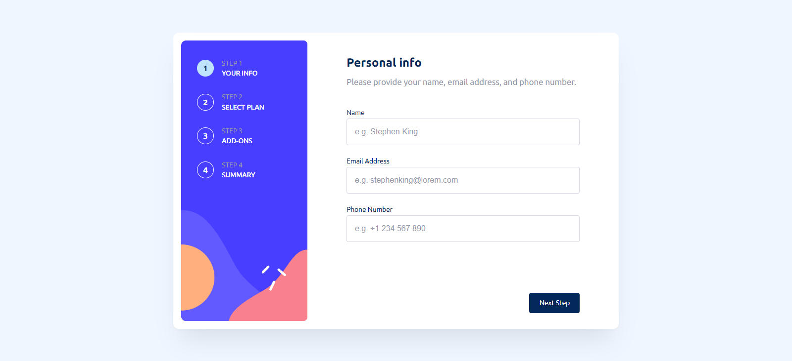
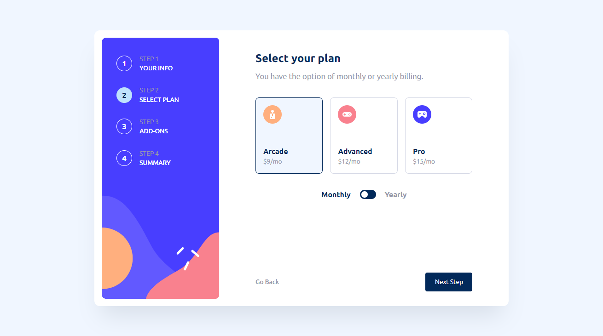

# Frontend Mentor - Multi-step form solution

This is a solution to the [Multi-step form challenge on Frontend Mentor](https://www.frontendmentor.io/challenges/multistep-form-YVAnSdqQBJ). Frontend Mentor challenges help you improve your coding skills by building realistic projects. 

## Table of contents

- [Overview](#overview)
  - [The challenge](#the-challenge)
  - [Screenshots](#screenshot)
  - [Links](#links)
- [My process](#my-process)
  - [Built with](#built-with)
  - [What I learned](#what-i-learned)
  - [Continued development](#continued-development)
- [Author](#author)

## Overview

### The challenge

Users should be able to:

- Complete each step of the sequence
- Go back to a previous step to update their selections
- See a summary of their selections on the final step and confirm their order
- View the optimal layout for the interface depending on their device's screen size
- See hover and focus states for all interactive elements on the page
- Receive form validation messages if:
  - A field has been missed
  - The email address is not formatted correctly
  - A step is submitted, but no selection has been made

### Screenshots

### Links

- Solution URL: [GitHub Repo](https://github.com/Patrick-Dolan/FM-multi-step-form)
- Live Site URL: [Live site](https://patrick-dolan.github.io/FM-multi-step-form/)

## My process

### Built with

- HTML & CSS
- Mobile-first workflow
- Plain old JavaScript

### What I learned

One of the things I am most proud of in this project is my use of closures to handle UI logic. I wanted to practice closures and UI logic felt like a useful point of implementation. I'm sure there are improvements to be made, but I found the concept of creating a closure to handle DOM manipulation to be the coolest thing. It feels very intuitive to store the DOM elements in closures and change them as needed. The stepHandler function is my favorite, but I did use closures in a few ways throughout the project. 

I also really enjoyed learning about the FormData object. I had never used it before but figured I would try it out in this instance as in the past I have manually written on all my form input data into objects which feels pretty silly now. 

### Continued development

This project more than any of my previous ones has me looking for better ways to organize my CSS and media queries. For the time being, I added all media queries directly after whatever element they would be changing; while this means there are a lot more media queries than necessary, it seemed like the most logical solution I could come up with as I was changing styles. I wanted to be able to quickly and easily tell what styles were before and after a change. I foresee this way of doing media queries as being a potential issue in a larger site but I haven't looked at design patterns for this kind of thing before. 

## Author

- Website - [Patrick Dolan](https://patrickdolan.dev/)
- Frontend Mentor - [@Patrick-Dolan](https://www.frontendmentor.io/profile/Patrick-Dolan)
